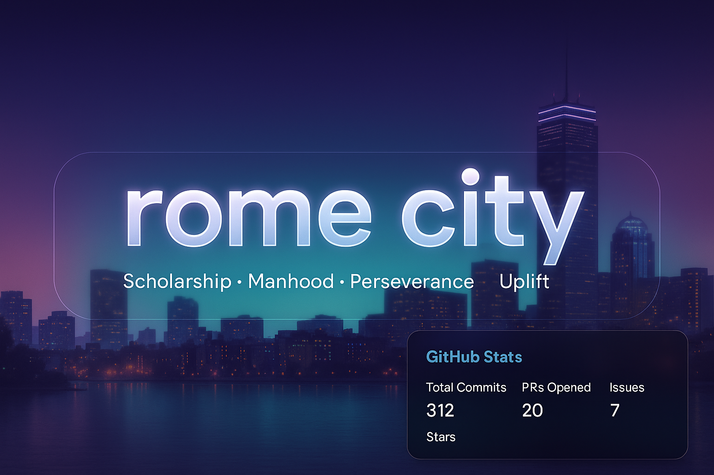

  

<h1 align="center">👋🏾 Hi, I'm rome city</h1>
<h3 align="center">Full Stack Developer | Builder of Tinbit 💘 | Passionate about Cloud & Distributed Systems</h3>

---

  
  

---

## 🚀 About Me

I'm a developer with internship experience at Apple and NOC experience at Wayfair. Currently focused on full stack development using JavaScript technologies and scaling projects in the cloud.

---

## 🔨 Featured Projects

### [🔗 Tinbit – Emoji Dating App](https://github.com/romecity/tinbit-app)
💘 A fun, expressive emoji-based dating platform built with:
- **Node.js** + **Express** backend
- **React** frontend
- Planned **cloud-native distributed deployment**

---

### [📱 Goal Keeper (Android App)](https://github.com/romecity/goal-keeper-android)
🎯 A mobile app that helps users set, track, and achieve personal goals.  
Built using **Java** and the **Android SDK**.

---

### 🧪 GitHub Classroom Projects

- [Project 1](https://classroom.github.com/a/qlutWmNt)
- [Project 2](https://classroom.github.com/a/V9xrFToE)
- [Project 3](https://classroom.github.com/a/GGMuWdbr)
- [Project 4](https://classroom.github.com/a/LWBcsnmf)

---

### 🎓 CS-665 Advanced Software Engineering Projects  
Hands-on assignments focused on software design patterns and architecture using Java.

- [Assignment 1](https://github.com/metcs/met-cs665-assignment-1-romecity): *Introduction to object-oriented programming and message dispatching systems*
- [Assignment 2](https://github.com/metcs/met-cs665-assignment-2-romecity): *Implemented the Factory Method pattern for a delivery dispatching system*
- [Assignment 3](https://github.com/metcs/met-cs665-assignment-3-romecity): *Used Strategy and Observer patterns to simulate customer notifications and preferences*
- [Assignment 4](https://github.com/metcs/met-cs665-assignment-4-romecity): *Built a complete modular system with a combination of design patterns for extensibility*

---

## 🛠️ Tech Stack

  
  
  
  
  
  
  
  
  
  

---

## 📚 Currently Learning

- Distributed Systems Architecture
- CI/CD using GitHub Actions
- React Native (Tinbit mobile MVP)

---

## 📊 GitHub Stats

  
   
  

---

## 🗣️ Quote I Live By

> “I build for connection. I build for joy. I build for impact.” — rome city

---
